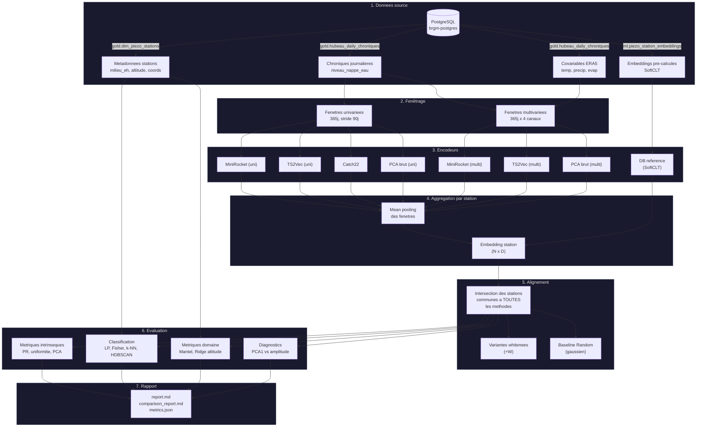
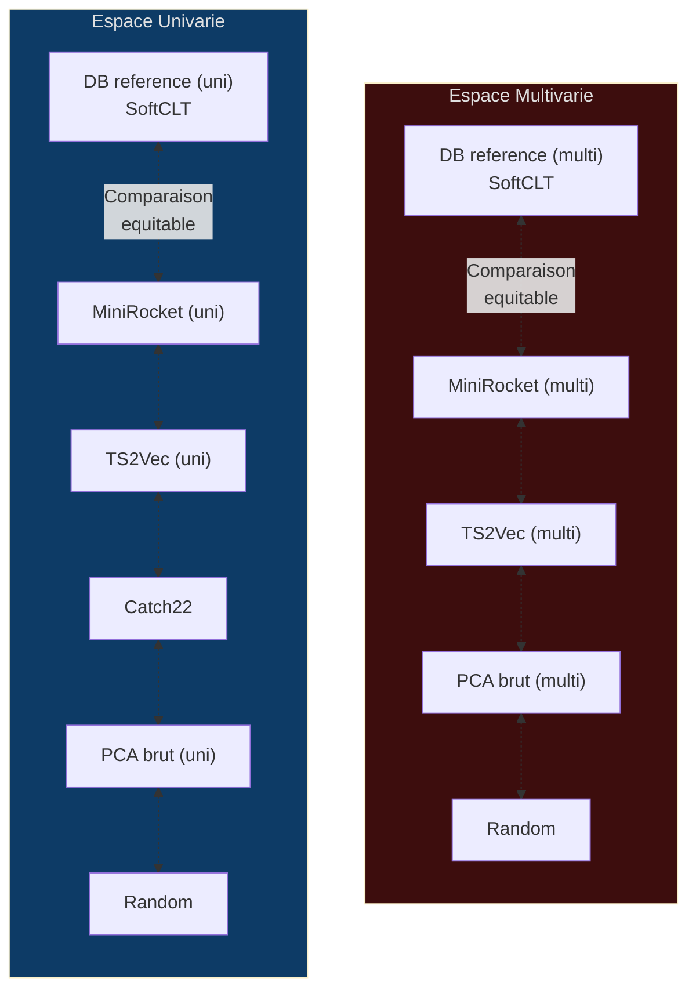

# Protocole de Benchmark des Embeddings — Projet Junon

> Document de reference pour l'evaluation et la comparaison des methodes d'embedding
> appliquees aux stations piezometriques et hydrometriques du reseau BRGM.

---

## Table des matieres

1. [Introduction](#1-introduction)
2. [Architecture / Pipeline](#2-architecture--pipeline)
3. [Espaces d'entree (uni vs multi)](#3-espaces-dentree-uni-vs-multi)
4. [Encodeurs compares](#4-encodeurs-compares)
5. [Metriques d'evaluation](#5-metriques-devaluation)
6. [Protocole anti-biais](#6-protocole-anti-biais)
7. [Comment executer le benchmark](#7-comment-executer-le-benchmark)
8. [Comment lire le rapport](#8-comment-lire-le-rapport)
9. [Glossaire](#9-glossaire)

---

## 1. Introduction

### Qu'est-ce qu'un embedding ?

Un **embedding** est une representation numerique compacte d'un objet complexe — ici, une
station de mesure et sa chronique temporelle. Concretement, chaque station est transformee
en un vecteur de nombres reels (par exemple 64 ou 320 dimensions) qui capture les
caracteristiques essentielles de son comportement temporel.

**Analogie** : imaginez que chaque station est un vin. L'embedding serait sa fiche de
degustation numerisee — acidite, tanins, rondeur, longueur en bouche — un ensemble de
scores qui permet de comparer les vins entre eux sans avoir a tous les gouter. Deux vins
avec des fiches similaires ont des profils similaires.

### Pourquoi des embeddings pour les stations piezometriques ?

Le reseau BRGM comporte des centaines de stations piezometriques, chacune avec des
annees de mesures journalieres. Comparer directement ces chroniques brutes pose
plusieurs problemes :

- **Longueurs differentes** : certaines stations ont 5 ans de donnees, d'autres 30 ans
- **Dimensions incompatibles** : comparer 10 000 jours de mesures point a point est instable
- **Bruit** : les valeurs brutes contiennent du bruit de mesure qui masque les tendances
- **Passage a l'echelle** : les algorithmes de clustering et de classification ont besoin de
  representations de taille fixe

Les embeddings resolvent ces problemes en compressant chaque station en un vecteur de
taille fixe qui preserve les proprietes importantes : comportement inertiel vs reactif,
saisonnalite, type de milieu hydrogeologique, etc.

### Que fait ce benchmark ?

Le script `embedding_benchmark.py` repond a la question fondamentale :

> **Quel encodeur produit les meilleurs embeddings pour nos stations ?**

Il compare systematiquement 6 methodes d'embedding selon 12+ metriques couvrant :

- La qualite geometrique de l'espace (les embeddings occupent-ils bien l'espace ?)
- La capacite a separer les types hydrogeologiques connus
- La coherence avec la geographie et les proprietes physiques des stations
- La detection de problemes (collapse, fuite de donnees, biais d'amplitude)

---

## 2. Architecture / Pipeline

### Vue d'ensemble

Le pipeline complet transforme les donnees brutes en scores de qualite selon le
diagramme suivant :



### Etapes detaillees

#### Etape 1 — Chargement des donnees

Le script se connecte a la base PostgreSQL BRGM et charge :

- **Chroniques journalieres** : `gold.hubeau_daily_chroniques` contient les mesures
  `niveau_nappe_eau` et les covariables ERA5 (temperature, precipitation, evaporation
  potentielle)
- **Embeddings pre-calcules** : `ml.piezo_station_embeddings` contient les embeddings
  produits par le pipeline SoftCLT du projet (reference a battre)
- **Metadonnees** : `gold.dim_piezo_stations` et `gold.int_station_era5_mapping` fournissent
  les labels hydrogeologiques (milieu_eh, theme_eh), l'altitude, les coordonnees GPS,
  la profondeur, etc.

#### Etape 2 — Fenetrage

Les chroniques brutes sont decoupees en **fenetres glissantes** de 365 jours avec un
pas (stride) configurable :

- **stride = 90** : 4 fenetres par an, haute resolution mais couteuse en memoire
- **stride = 365** : 1 fenetre par an, plus rapide, recommandee en premiere approche

Avant le fenetrage, chaque serie est **normalisee en z-score** (moyenne 0, ecart-type 1)
pour que l'embedding capture la **forme** du signal et non son amplitude brute.

#### Etape 3 — Encodage

Chaque fenetre passe dans un encodeur qui produit un vecteur de features. Les 6 encodeurs
sont decrits en detail dans la [section 4](#4-encodeurs-compares).

#### Etape 4 — Aggregation

Chaque station a typiquement N fenetres (par ex. 10 fenetres pour 10 ans de donnees).
L'embedding final de la station est le **mean pooling** (moyenne) de ses fenetres :

```
embedding_station = mean(embedding_fenetre_1, embedding_fenetre_2, ..., embedding_fenetre_N)
```

#### Etape 5 — Alignement

Pour une comparaison equitable, le script calcule l'**intersection** des stations
presentes dans TOUTES les methodes. Seules ces stations communes sont evaluees.
Des variantes **whitenees** (+W) sont aussi generees pour tester si un post-traitement
simple ameliore les resultats.

#### Etape 6 — Evaluation

Les 12+ metriques sont calculees sur chaque ensemble d'embeddings alignes.
Voir la [section 5](#5-metriques-devaluation) pour le detail.

#### Etape 7 — Rapport

Les resultats sont sauvegardes sous forme de :
- `comparison_report.md` : tableaux Markdown lisibles
- `data/metrics.json` : donnees brutes pour analyse programmatique

---

## 3. Espaces d'entree (uni vs multi)

### Definitions

| Espace | Dimensions par pas de temps | Contenu |
|--------|----------------------------|---------|
| **Univarie** (uni) | 1 | Uniquement le niveau de la nappe (`niveau_nappe_eau`) |
| **Multivarie** (multi) | 4 | Niveau de nappe + 3 covariables ERA5 : temperature a 2m, precipitation totale, evaporation potentielle |

### Pourquoi l'espace multivarie ?

L'espace univarie capture le **comportement propre** de la nappe. L'espace multivarie
ajoute le **contexte climatique** : une nappe qui reagit fortement a la pluie sera
differenciee d'une nappe inertielle meme si leurs niveaux bruts sont similaires.

**Analogie** : l'univarie c'est ecouter la voix d'un chanteur a cappella. Le multivarie
c'est ecouter la voix avec l'accompagnement — on peut alors distinguer si le chanteur
suit le rythme de la musique ou s'il est en decalage.

### Pourquoi evaluer SEPAREMENT ?

C'est un point fondamental du protocole :

> Les methodes univariees et multivariees ne sont comparees qu'**au sein de leur
> propre espace**.

Concretement :
- MiniRocket (uni) est compare a TS2Vec (uni), Catch22, PCA brut (uni), et Random
- MiniRocket (multi) est compare a TS2Vec (multi), PCA brut (multi), et Random
- On **ne compare jamais** directement MiniRocket (uni) a MiniRocket (multi)

**Pourquoi ?** Parce qu'un encodeur multivarie a acces a plus d'information. Le
comparer directement a un encodeur univarie serait comme comparer un eleve qui a
eu les sujets a l'avance avec un eleve qui ne les a pas eus.

Les embeddings pre-calcules en base (DB uni, DB multi) servent de **reference** dans
leur espace respectif.



> **Note** : Catch22 n'existe qu'en univarie car la bibliotheque `pycatch22` ne
> supporte pas les entrees multivariees nativement.

---

## 4. Encodeurs compares

### 4.1 DB reference (SoftCLT)

**Comment ca marche** : c'est l'encodeur du pipeline de production Junon. Il utilise
SoftCLT (Soft Contrastive Learning for Time series), un apprentissage contrastif qui
entraine un reseau a produire des representations proches pour des fenetres temporelles
"similaires" et eloignees pour des fenetres "differentes". Les embeddings resultants
sont stockes dans PostgreSQL (table `ml.piezo_station_embeddings`).

**Ce qui le differencie** : c'est la reference a battre. Il a ete entraine specifiquement
sur nos donnees piezometriques avec un pipeline optimise.

**Forces** :
- Optimise pour le domaine piezometrique
- Deja integre dans la plateforme Junon
- Supporte uni et multivarie

**Faiblesses** :
- Necessite un entrainement GPU couteux
- Peut overfitter sur les donnees d'entrainement
- Boite noire (difficile d'interpreter ce que l'embedding capture)

---

### 4.2 MiniRocket

**Comment ca marche** : MiniRocket (bibliotheque `aeon`) genere des milliers de
**noyaux convolutifs aleatoires** (mais deterministes) et calcule pour chaque fenetre
la proportion de valeurs positives apres convolution. Cela produit un vecteur de 9 996
features, ensuite reduit par PCA a 320 dimensions.

**Analogie** : imaginez 9 996 "filtres" differents appliques sur la serie temporelle —
certains detectent les pics, d'autres les tendances, d'autres les oscillations. Chaque
filtre donne un score (proportion de temps ou le pattern est present). L'ensemble de
ces scores forme l'embedding.

**Ce qui le differencie** : aucun apprentissage. Les noyaux sont generes
aleatoirement (avec graine fixe), seule la PCA finale est ajustee.

**Forces** :
- Tres rapide (pas d'entrainement de reseau de neurones)
- Deterministe (reproductible)
- Generalement performant en classification de series temporelles
- Supporte uni et multivarie nativement

**Faiblesses** :
- Espace de features initial tres grand (9 996D) necessitant une PCA
- Les noyaux ne sont pas adaptes au domaine
- Ne capture pas les dependances a tres long terme

---

### 4.3 TS2Vec

**Comment ca marche** : TS2Vec est un encodeur contrastif (meme famille que SoftCLT).
Il entraine un reseau de neurones temporel a produire des representations ou :
- Deux fenetres **de la meme serie** sont proches
- Deux fenetres **de series differentes** sont eloignees

L'encodeur est entraine sur un echantillon des fenetres (max 20 000), puis utilise pour
encoder toutes les fenetres. L'embedding temporel est moyenne sur l'axe temps pour
obtenir un vecteur par fenetre.

**Ce qui le differencie** : apprentissage contrastif auto-supervise — pas besoin de labels.

**Forces** :
- Capture les structures temporelles a differentes echelles
- Auto-supervise : pas besoin de labels
- Supporte uni et multivarie
- Meme famille que SoftCLT, utile pour la comparaison

**Faiblesses** :
- Necessite GPU pour un entrainement raisonnable
- Stochastique (resultats peuvent varier entre executions)
- Temps d'entrainement non negligeable (50 epochs par defaut)

---

### 4.4 Catch22

**Comment ca marche** : Catch22 extrait 22 features statistiques interpretables de
chaque fenetre temporelle. Ces features couvrent :
- L'autocorrelation (memoire du signal)
- La distribution des valeurs (asymetrie, queues)
- Les proprietes spectrales (periodicites)
- La non-linearite (reversibilite temporelle)
- Les statistiques de retour a la moyenne

L'embedding final est la moyenne des 22 features sur toutes les fenetres de la station.

**Analogie** : c'est comme faire passer un bilan sanguin a chaque fenetre — 22 indicateurs
standardises et bien definis. On fait ensuite la moyenne des bilans sur toutes les annees.

**Ce qui le differencie** : completement interpretable. Chaque dimension a un sens precis.

**Forces** :
- Totalement interpretable (chaque feature a un nom et un sens)
- Tres rapide
- Robuste, pas d'apprentissage

**Faiblesses** :
- Univarie uniquement
- Seulement 22 dimensions (capacite de representation limitee)
- Ne capture pas les patterns specifiques au domaine piezometrique

---

### 4.5 PCA brut

**Comment ca marche** : aucun encodeur. Les fenetres brutes normalisees sont empilees
dans une matrice et une PCA est appliquee directement pour reduire a 64 dimensions.
Pour le multivarie, les fenetres (365 x 4 canaux) sont aplaties en vecteurs de 1 460
valeurs avant la PCA.

**Analogie** : c'est comme resumer un livre en ne gardant que les 64 axes de variation
les plus importants entre tous les livres de la bibliotheque, sans aucune intelligence
linguistique.

**Ce qui le differencie** : baseline minimale. Si un encodeur fait moins bien que PCA brut,
il detruit de l'information au lieu d'en extraire.

**Forces** :
- Aucun hyperparametre d'encodeur a regler
- Rapide
- Baseline "plancher" — tout encodeur devrait faire mieux

**Faiblesses** :
- Ne capture que les correlations lineaires
- Sensible au bruit
- Pas de notion de temporalite (traite chaque pas de temps independamment)

---

### 4.6 Random (gaussien)

**Comment ca marche** : chaque station recoit un vecteur de 64 nombres aleatoires
tires d'une distribution gaussienne standard (N(0,1), graine fixe 42).

**Ce qui le differencie** : aucune information sur les donnees. C'est le **plancher absolu**.

**Forces** :
- Definit le score minimum attendu
- Si une methode ne bat pas Random, elle est inutile
- Deterministe (graine fixe)

**Faiblesses** :
- Ne capture aucune information (c'est le but)

---

### Tableau comparatif des encodeurs

| Encodeur | Type | Apprentissage | Dim. sortie | Uni | Multi | Interpretable | Vitesse |
|----------|------|---------------|-------------|-----|-------|---------------|---------|
| DB ref (SoftCLT) | Contrastif | Supervise (auto) | 64-320 | Oui | Oui | Non | Pre-calcule |
| MiniRocket | Convolutif aleatoire | Non (PCA seule) | 320 | Oui | Oui | Non | Rapide |
| TS2Vec | Contrastif | Auto-supervise | 320 | Oui | Oui | Non | Moyen (GPU) |
| Catch22 | Features manuelles | Non | 22 | Oui | **Non** | **Oui** | Tres rapide |
| PCA brut | Reduction lineaire | Non (PCA seule) | 64 | Oui | Oui | Partiellement | Rapide |
| Random | Aucun | Non | 64 | N/A | N/A | Non | Instantane |

> **Lecture du tableau** : la colonne "Apprentissage" indique si l'encodeur necessite
> une phase d'entrainement. "Auto-supervise" signifie qu'il s'entraine sans labels,
> juste a partir des series temporelles elles-memes.

---

## 5. Metriques d'evaluation

Les metriques sont organisees en 4 familles :

1. **Metriques intrinseques** — qualite geometrique de l'espace d'embedding
2. **Metriques supervisees** — capacite a predire des labels connus
3. **Metriques de domaine** — coherence avec les proprietes physiques et geographiques
4. **Diagnostics** — detection de problemes et de biais

---

### 5.1 Metriques intrinseques

Ces metriques evaluent la qualite de l'espace d'embedding **sans utiliser de labels**.
Elles repondent a la question : "Est-ce que les embeddings occupent bien l'espace ?"

#### 5.1.1 Participation Ratio (PR)

**Ce que ca mesure** : combien de dimensions de l'embedding sont effectivement utilisees.

**Analogie** : imaginez un orchestre de 64 musiciens. Le PR mesure combien de musiciens
jouent reellement. Si PR = 5, alors seuls 5 "musiciens" dominent et les 59 autres
sont quasi-silencieux — c'est du gaspillage de dimensions.

**Formule** : `PR = (somme des valeurs propres)^2 / somme(valeurs propres^2)`

**Comment lire** :
- **PR eleve** (proche de la dimension de l'embedding) = bien. Les dimensions sont
  utilisees de maniere equilibree.
- **PR faible** (par ex. PR = 3 pour un embedding 64D) = mal. L'information est
  concentree sur tres peu de dimensions (collapse partiel).
- **Seuil indicatif** : PR > 20 pour un embedding 64D est correct.

**Pourquoi ca compte** : un PR faible signifie que l'encodeur gaspille des dimensions.
Un embedding 64D avec PR = 5 n'est pas meilleur qu'un embedding 5D.

---

#### 5.1.2 Uniformity

**Ce que ca mesure** : comment les embeddings sont distribues sur l'hypersphere unite.

**Analogie** : imaginez des billes posees sur un globe terrestre. L'uniformite mesure si
les billes sont reparties uniformement sur toute la surface, ou si elles sont toutes
regroupees au meme endroit.

**Formule** : `uniformity = log E[exp(-2 ||x - y||^2)]` (Wang & Isola 2020), calculee
sur les embeddings normalises a norme 1.

**Comment lire** :
- **Valeur tres negative** (par ex. -5, -10) = bien. Les embeddings sont repartis
  uniformement.
- **Valeur proche de 0** = mal. Les embeddings sont regroupes (collapse).
- En pratique, des valeurs entre -2 et -8 sont typiques pour de bons embeddings.

**Pourquoi ca compte** : si tous les embeddings sont au meme endroit, ils ne contiennent
pas d'information discriminante. L'uniformite detecte le **representation collapse**,
un probleme frequent des methodes contrastives.

> 💡 Le benchmark ne calcule que l'uniformite (pas l'alignement) car l'alignement
> necessite des paires positives au niveau fenetre, non disponibles pour les embeddings
> aggreges par station.

---

#### 5.1.3 Diagnostics PCA

**Ce que ca mesure** : la courbe de variance cumulee en PCA — combien de composantes
principales faut-il pour capturer X% de la variance ?

**Comment lire** :
- `n_80` : nombre de composantes pour 80% de la variance
- `n_90` : idem pour 90%
- `n_95` : idem pour 95%
- `n_99` : idem pour 99%

**Interpretation** :
- `n_95 = 3` sur un embedding 64D : tres mauvais signe. Toute l'information est
  concentree sur 3 axes, les 61 autres dimensions sont du bruit.
- `n_95 = 45` sur un embedding 64D : bon signe. L'information est repartie.

**Analogie** : c'est comme demander combien de "themes" il faut pour resumer 95% du
contenu d'une encyclopedie. Si 3 themes suffisent, l'encyclopedie est tres repetitive.

La **courbe de variance cumulee** (premiers 50 composantes) est aussi incluse dans les
resultats JSON pour tracer des graphiques.

**Pourquoi ca compte** : ces diagnostics sont complementaires du PR. Ils revelent si
l'embedding a une structure riche ou si quelques dimensions dominent tout.

---

### 5.2 Metriques supervisees (classification)

Ces metriques utilisent les **labels hydrogeologiques connus** (`milieu_eh` de la
classification BDLISA) pour evaluer si l'embedding capture l'information geologique.

Les labels `milieu_eh` codent le type de milieu :

| Code | Label |
|------|-------|
| 1 | Poreux |
| 2 | Fissure |
| 3 | Karstique |
| 4 | Double porosite fissure et poreux |
| 5 | Double porosite karstique et poreux |
| 6 | Double porosite karstique et fissure |
| 8 | Milieu composite |
| 9 | Milieu non applicable |

> ⚠️ La repartition des classes est **fortement desequilibree**. C'est pourquoi
> toutes les metriques utilisent des mesures equilibrees (balanced accuracy,
> macro F1, class_weight='balanced').

---

#### 5.2.1 Linear Probe (Sonde lineaire)

**Ce que ca mesure** : est-ce que l'information de classe est **lineairement separable**
dans l'espace d'embedding ? Autrement dit, une simple regression logistique peut-elle
retrouver le type hydrogeologique a partir de l'embedding ?

**Analogie** : imaginez les embeddings comme des points colores (chaque couleur = un type
de milieu) dans un espace 3D. Le linear probe demande : peut-on tracer des plans
(surfaces plates) qui separent correctement les couleurs ? Si oui, l'embedding organise
bien les types de milieu.

**Methode** :
1. Filtre les stations sans label et les classes trop rares (< 5 exemples)
2. Stratified K-Fold a 5 plis (chaque pli respecte les proportions de classes)
3. Pipeline : `StandardScaler` + `LogisticRegression(class_weight='balanced', max_iter=2000)`
4. Mesure sur chaque pli, puis moyenne

**Metriques rapportees** :

| Metrique | Comment lire | Signification |
|----------|-------------|---------------|
| `balanced_accuracy` | Plus c'est haut mieux c'est (max 1.0) | Accuracy moyenne par classe. Resiste au desequilibre. |
| `macro_f1` | Plus c'est haut mieux c'est (max 1.0) | Moyenne harmonique precision/rappel, par classe. |
| `accuracy` | Plus c'est haut mieux c'est (max 1.0) | Accuracy globale (biaisee par les classes majoritaires). |

**Comment interpreter** :
- **balanced_accuracy > 0.60** : l'embedding capture significativement l'info geologique
- **balanced_accuracy ~ 0.30** (pour 5 classes) : pas mieux que le hasard
- La matrice de confusion detaillee est aussi disponible dans le JSON

**Deux variantes sont testees** :
- **milieu_eh** seul : 6-8 classes de milieu hydrogeologique
- **milieu_eh x theme_eh** (compound) : croisement milieu x theme, plus de classes, plus difficile

---

#### 5.2.2 Fisher Criterion

**Ce que ca mesure** : la separation geometrique des classes dans l'espace d'embedding,
**sans ajuster de modele**.

**Analogie** : imaginez des nuages de points colores. Le critere de Fisher mesure le ratio
entre la distance entre les centres des nuages (separation inter-classe) et la taille
des nuages (dispersion intra-classe). Un ratio eleve signifie des nuages compacts et
bien separes.

**Formule** : `Fisher = trace(S_b) / trace(S_w)` ou :
- `S_b` = matrice de dispersion inter-classes (between)
- `S_w` = matrice de dispersion intra-classe (within)

**Comment lire** :
- **Plus c'est eleve mieux c'est** (pas de maximum theorique)
- `Fisher = 0` : les classes sont completement melangees
- `Fisher > 1` : la separation inter-classe depasse la dispersion intra-classe
- Ce qui compte surtout, c'est le **classement relatif** entre encodeurs

**Pourquoi ca compte** : contrairement au linear probe, le Fisher ne depend d'aucun
classificateur. C'est une mesure geometrique pure de la qualite de separation.

---

#### 5.2.3 k-NN Retrieval (Precision@k)

**Ce que ca mesure** : pour une station donnee, parmi ses k plus proches voisins dans
l'espace d'embedding, combien partagent le meme type hydrogeologique ?

**Analogie** : dans une bibliotheque ou les livres sont ranges par l'embedding, si vous
prenez un roman policier, combien de ses 5 voisins sur l'etagere sont aussi des
romans policiers ?

**Methode** : distance cosinus entre embeddings, puis pour chaque station on regarde
la fraction de ses k voisins qui ont le meme label.

**Metriques rapportees** :

| Metrique | Comment lire |
|----------|-------------|
| `precision@1` | Fraction des voisins les plus proches avec le meme label |
| `precision@5` | Fraction des 5 plus proches voisins avec le meme label |
| `precision@10` | Idem pour 10 voisins |
| `precision@20` | Idem pour 20 voisins |
| `random_baseline` | Score attendu au hasard (somme des frequences de classes au carre) |

**Comment interpreter** :
- Comparer systematiquement a `random_baseline`
- `P@5 = 0.60` avec `random_baseline = 0.25` : tres bon
- `P@5 = 0.30` avec `random_baseline = 0.25` : a peine mieux que le hasard
- P@1 est le plus exigeant, P@20 le plus permissif

**Pourquoi ca compte** : le k-NN est le test de voisinage le plus direct. Si les
voisins dans l'espace d'embedding ne partagent pas les memes proprietes, l'embedding
ne structure pas bien les donnees.

---

#### 5.2.4 HDBSCAN AMI/ARI

**Ce que ca mesure** : si l'on clusterise les embeddings avec HDBSCAN (clustering
automatique base sur la densite), les clusters retrouves correspondent-ils aux types
hydrogeologiques connus ?

**Analogie** : on laisse un algorithme former des groupes "a l'aveugle" (sans connaitre
les labels), puis on compare ses groupes aux vrais types de milieu. Si les groupes
correspondent, l'embedding a bien structure les donnees.

**Parametres** : `HDBSCAN(min_cluster_size=25, min_samples=5)` — seuls les points
non-bruit (-1) sont utilises pour le score.

**Metriques rapportees** :

| Metrique | Plage | Comment lire |
|----------|-------|-------------|
| `AMI` (Adjusted Mutual Information) | [-0.5, 1.0] | 0 = pas mieux que le hasard, 1 = correspondance parfaite |
| `ARI` (Adjusted Rand Index) | [-0.5, 1.0] | 0 = hasard, 1 = parfait, negatif = pire que le hasard |

**Comment interpreter** :
- **AMI/ARI > 0.3** : correspondance significative entre clusters et labels
- **AMI/ARI ~ 0** : les clusters ne correspondent pas aux types hydrogeologiques
- AMI est plus robuste que ARI aux differences de nombre de clusters

**Pourquoi ca compte** : cette metrique teste si l'embedding fait emerger
**naturellement** des groupes correspondant a la realite geologique, sans aucun
guidage supervise.

---

#### 5.2.5 Typologie dynamique (inertiel / annuel / reactif)

**Ce que ca mesure** : les embeddings capturent-ils le **comportement temporel** des nappes ?

Cette metrique utilise des labels calcules directement a partir des series temporelles
(pas de source externe). Trois classes sont definies a partir de l'autocorrelation a
365 jours :

| Classe | ACF lag-365 | Description |
|--------|------------|-------------|
| **Inertiel** | > 0.7 | Nappe lente, forte memoire, peu influencee par les saisons |
| **Annuel** | 0.3 — 0.7 | Cycle annuel marque, reponse moderee |
| **Reactif** | < 0.3 | Reponse rapide, peu de memoire, tres variable |

**Methode** : les memes metriques de classification (Linear Probe, Fisher, k-NN) sont
appliquees avec ces labels derives.

> ⚠️ **Attention** : ces labels sont **derives des memes series** que les embeddings.
> Ce n'est donc pas une evaluation independante mais un **test de coherence** : si un
> encodeur ne capture meme pas la dynamique temporelle de base qu'il a observee, il
> est tres probablement defaillant.

**Comment interpreter** :
- Des scores eleves sont **attendus** (c'est un test de coherence, pas un exploit)
- Des scores faibles pour un encodeur qui a VU les donnees sont un signal d'alarme
- Utile surtout pour detecter les methodes deficientes

---

### 5.3 Metriques de domaine

#### 5.3.1 Ridge Regression (altitude)

**Ce que ca mesure** : est-ce que l'altitude de la station (propriete topographique
exogene) est **lineairement decodable** a partir de l'embedding ?

**Analogie** : si je vous donne l'embedding d'une station sans vous dire ou elle est,
pouvez-vous deviner son altitude ? Si oui, l'embedding encode implicitement de
l'information geographique/topographique.

**Methode** :
1. K-Fold a 5 plis (non stratifie car cible continue)
2. Pipeline : `StandardScaler` + `Ridge(alpha=1.0)`
3. Cible normalisee (z-score) pour comparabilite

**Metriques rapportees** :

| Metrique | Plage | Comment lire |
|----------|-------|-------------|
| `r2` | [-inf, 1.0] | 1 = prediction parfaite, 0 = aussi bon que predire la moyenne, negatif = pire |
| `spearman` | [-1, 1] | Correlation de rang entre prediction et realite. 1 = ordre parfaitement respecte |

> ⚠️ **Anti-fuite** : seule l'altitude est utilisee comme cible de regression car
> elle est **purement exogene** (topographique). Les metriques derivees des series
> (profondeur, ecart-type, amplitude) sont **exclues** car elles constituent une
> fuite de donnees (l'encodeur a vu les series).

**Pourquoi ca compte** : l'altitude est une propriete physique du site. Si l'embedding
capture cette information, c'est que les signaux piezometriques different
systematiquement selon l'altitude — ce qui est hydrologiquement coherent.

---

#### 5.3.2 Mantel Test (correlation geographique)

**Ce que ca mesure** : y a-t-il une correlation entre la **distance geographique**
entre deux stations et leur **distance dans l'espace d'embedding** ?

**Analogie** : les stations proches geographiquement ont-elles des embeddings proches ?
C'est comme demander si les vins d'une meme region se ressemblent plus que les vins
de regions eloignees.

**Methode** :
1. Sous-echantillon de 500 stations (pour la tractabilite)
2. Distance geographique : haversine (en km)
3. Distance d'embedding : cosinus
4. Correlation de Spearman entre les deux matrices de distance
5. Test de permutation (999 permutations) pour la significativite (p-value)

**Metriques rapportees** :

| Metrique | Plage | Comment lire |
|----------|-------|-------------|
| `r` (Spearman) | [-1, 1] | Correlation entre distances geo et distances embedding. Plus c'est eleve, plus l'embedding respecte la geographie. |
| `p` (p-value) | [0, 1] | Significativite. `p < 0.05` = significatif. |

**Comment interpreter** :
- `r = 0.3, p < 0.01` : correlation geographique moderee et significative
- `r = 0.0, p > 0.05` : pas de structure geographique dans l'embedding
- `r > 0.5` serait remarquable (la geographie explique beaucoup de la structure)

> 💡 Une correlation geographique est **attendue** (les nappes d'une meme region
> partagent souvent la meme geologie) mais ne doit pas etre **trop forte** (sinon
> l'embedding ne capture que la position et pas le comportement).

---

### 5.4 Diagnostics

#### 5.4.1 PCA1 vs amplitude (diagnostic de normalisation)

**Ce que ca mesure** : le premier axe principal de l'embedding est-il correle avec
l'amplitude (ou la moyenne) des mesures brutes ?

**Pourquoi c'est crucial** : si la normalisation (z-score) est deficiente ou absente,
l'embedding encode principalement **l'echelle des valeurs** plutot que **la forme du
signal**. Deux nappes a profondeur similaire auront des embeddings proches meme si
leur comportement est completement different.

**Methode** :
1. PCA a 1 composante sur les embeddings
2. Calcul de la moyenne du `niveau_nappe_eau` par station
3. Correlation de Pearson entre la composante PC1 et la moyenne

**Comment lire** :

| Correlation |r| | Interpretation |
|---------------|----------------|
| > 0.8 | **CRITIQUE** : l'embedding encode l'amplitude, pas la forme. Normalisation probablement absente. |
| 0.5 — 0.8 | **ATTENTION** : encodage partiel de l'amplitude. Normalisation peut-etre insuffisante. |
| < 0.5 | **OK** : le premier axe capture autre chose que l'amplitude. |

> ⚠️ **C'est le test le plus important du benchmark.** Un embedding avec r > 0.8
> est fondamentalement defaillant, meme si ses autres metriques sont bonnes (car les
> metriques supervisees peuvent etre artificiellement gonflees par la correlation
> amplitude-geologie).

---

#### 5.4.2 Post-hoc whitening (+W)

**Ce que ca mesure** : un simple post-traitement de whitening ameliore-t-il les scores ?

**Comment ca marche** : le whitening (`PCA(whiten=True)`) transforme les embeddings pour
que chaque composante principale ait une variance unitaire. Cela corrige le "representation
collapse" ou quelques dimensions dominent les autres.

**Analogie** : c'est comme egaler le volume de chaque instrument dans un orchestre. Si les
violons jouent 100x plus fort que les flutes, le whitening ramene tout le monde au
meme niveau.

**Comment lire** :
- Si `methode +W` >> `methode` (gain important) : l'embedding original souffre de
  collapse partiel. Le whitening est un remede efficace.
- Si `methode +W` ~ `methode` (pas de changement) : l'embedding est deja bien distribue.
- Si `methode +W` << `methode` (degradation) : la structure concentree sur peu de
  dimensions est **informative** et le whitening la detruit.

> 💡 Le whitening n'est **pas** applique a Random (pas de sens) ni a PCA brut
> (qui est deja une PCA).

---

### 5.5 Resume des metriques

| Metrique | Famille | Direction | Ce qu'elle teste |
|----------|---------|-----------|-----------------|
| Participation Ratio | Intrinseque | Plus haut = mieux | Utilisation effective des dimensions |
| Uniformity | Intrinseque | Plus negatif = mieux | Distribution sur l'hypersphere |
| PCA n_80/n_95/n_99 | Intrinseque | Plus haut = mieux | Repartition de l'information |
| Linear Probe BalAcc | Supervisee | Plus haut = mieux | Separabilite lineaire des classes |
| Linear Probe F1 | Supervisee | Plus haut = mieux | Equilibre precision/rappel |
| Fisher Criterion | Supervisee | Plus haut = mieux | Separation geometrique des classes |
| k-NN P@k | Supervisee | Plus haut = mieux | Structure de voisinage |
| HDBSCAN AMI | Supervisee | Plus haut = mieux | Clustering naturel vs labels |
| HDBSCAN ARI | Supervisee | Plus haut = mieux | Clustering naturel vs labels |
| Dynamic Typology | Coherence | Plus haut = attendu | Capture de la dynamique temporelle |
| Ridge R2 (altitude) | Domaine | Plus haut = mieux | Information topographique encodee |
| Mantel r | Domaine | Plus haut = mieux | Coherence geographique |
| PCA1 vs amplitude | Diagnostic | Plus bas = mieux | Detection de biais d'amplitude |

---

## 6. Protocole anti-biais

Le benchmark met en oeuvre plusieurs mesures pour garantir l'equite de la comparaison.

### 6.1 Intersection des stations communes

**Probleme** : chaque encodeur peut echouer sur certaines stations (donnees
insuffisantes, NaN, etc.). Si MiniRocket a 400 stations et TS2Vec en a 350, une
comparaison directe n'est pas equitable.

**Solution** : le benchmark calcule l'**intersection** des stations presentes dans
TOUTES les methodes et n'evalue que sur ces stations communes.

```python
common_ids, aligned = _align_to_common_ids(methods)
```

Ainsi, chaque encodeur est evalue sur **exactement les memes stations**, eliminant
tout biais de selection.

---

### 6.2 class_weight='balanced'

**Probleme** : la distribution des types hydrogeologiques est tres desequilibree.
"Poreux" peut representer 60% des stations tandis que "Karstique" n'en represente que 5%.
Un classificateur naif qui predit toujours "Poreux" atteindrait 60% d'accuracy.

**Solution** : `class_weight='balanced'` dans la regression logistique pondere les
erreurs en fonction inverse de la frequence de classe. Une erreur sur une station
karstique coute 12x plus qu'une erreur sur une station poreuse.

De plus, la **balanced accuracy** (moyenne des rappels par classe) est utilisee comme
metrique principale, plutot que l'accuracy globale.

---

### 6.3 Stratified K-Fold

**Probleme** : avec un K-Fold simple, certains plis pourraient ne contenir aucun
exemple de classes rares.

**Solution** : `StratifiedKFold(n_splits=5, shuffle=True, random_state=42)` garantit
que chaque pli contient approximativement la meme proportion de chaque classe.

Les classes avec moins de `n_splits` (5) exemples sont exclues de l'evaluation
pour eviter les artefacts.

---

### 6.4 Pas de fuite de donnees

**Probleme** : certaines proprietes des stations (ecart-type, amplitude, profondeur
moyenne) sont **derivees des memes series temporelles** que les embeddings. Les
utiliser comme cibles de regression serait de la triche : l'encodeur a deja vu
cette information.

**Solution** : seule l'**altitude** est utilisee comme cible de regression, car elle
est purement topographique et ne provient pas des chroniques piezometriques.

```python
# altitude = topographic, fully exogenous to the time series
# depth/stddev/amplitude are DERIVED from the series → data leakage, excluded
regression_targets = {}
for target in ("altitude",):
    ...
```

Les labels `milieu_eh` (type de milieu hydrogeologique) sont des **annotations externes**
issues de la classification BDLISA et ne posent pas de probleme de fuite.

---

### 6.5 Baseline aleatoire

**Probleme** : sans reference, il est impossible de savoir si un score est "bon" ou "mauvais".

**Solution** : l'encodeur **Random** (gaussien, 64D) est toujours inclus. Il definit le
plancher absolu : tout encodeur qui ne bat pas Random ne capture aucune information utile.

De plus, pour le k-NN, le `random_baseline` (somme des frequences de classes au carre)
est explicitement calcule et affiche.

---

### 6.6 Evaluation par espace

**Probleme** : comparer un encodeur univarie a un encodeur multivarie est injuste car
le multivarie a acces a 4x plus d'information.

**Solution** : l'evaluation est faite **separement** pour chaque espace d'entree (uni,
multi). Le classement final est produit par espace. Seul le Random est partage entre
les deux espaces (il ne voit aucune donnee de toute facon).

---

### 6.7 Graines aleatoires fixees

**Probleme** : la stochasticite (MiniRocket, TS2Vec, permutations) peut faire varier
les resultats d'une execution a l'autre.

**Solution** : toutes les operations aleatoires utilisent `random_state=42` ou
`RandomState(42)` pour la reproductibilite.

---

### Resume des mesures anti-biais

| Biais potentiel | Mesure corrective |
|-----------------|-------------------|
| Stations differentes par methode | Intersection commune |
| Classes desequilibrees | class_weight='balanced', balanced accuracy, macro F1 |
| Plis inegaux | Stratified K-Fold |
| Fuite de donnees (series → cibles) | Uniquement altitude (exogene) comme cible regression |
| Pas de reference | Baseline Random |
| Comparaison uni vs multi | Evaluation par espace separe |
| Stochasticite | Graines fixees (42) |
| Classes trop rares | Exclusion des classes < 5 exemples |

---

## 7. Comment executer le benchmark

### Pre-requis

- Acces a la base PostgreSQL BRGM (`brgm-postgres:5432`)
- Python 3.12 avec les dependances :
  - `numpy`, `pandas`, `scikit-learn`, `scipy`, `sqlalchemy`
  - `aeon` (pour MiniRocket)
  - `ts2vec`, `torch` (pour TS2Vec)
  - `pycatch22` (pour Catch22)
- GPU recommande pour TS2Vec (CPU possible mais lent)
- Les embeddings de reference doivent etre presents dans `ml.piezo_station_embeddings`

### Mode `evaluate` — Evaluer les embeddings en base

Evalue uniquement les embeddings deja stockes dans PostgreSQL (SoftCLT de production).
Rapide, pas de GPU necessaire.

```bash
# Evaluer tous les espaces (piezo/uni, piezo/multi, hydro/uni, hydro/multi)
python scripts/embedding_benchmark.py --mode evaluate

# Evaluer un seul espace
python scripts/embedding_benchmark.py --mode evaluate --spaces piezo/uni

# Specifier le repertoire de sortie
python scripts/embedding_benchmark.py --mode evaluate --output reports/eval_run
```

### Mode `compare` — Comparaison multi-encodeurs

Compare 6 encodeurs sur les memes stations. Plus long car il calcule les embeddings
MiniRocket, TS2Vec, Catch22 et PCA brut a la volee.

```bash
# Comparaison complete (tous les espaces, toutes les stations)
python scripts/embedding_benchmark.py --mode compare

# Comparaison sur un sous-ensemble de stations (plus rapide)
python scripts/embedding_benchmark.py --mode compare --max-stations 200

# Comparaison uniquement sur piezo/uni et piezo/multi
python scripts/embedding_benchmark.py --mode compare --spaces piezo/uni piezo/multi

# Combinaison : piezo seulement, 300 stations max
python scripts/embedding_benchmark.py --mode compare --spaces piezo/uni piezo/multi --max-stations 300
```

### Parametres

| Parametre | Valeur par defaut | Description |
|-----------|-------------------|-------------|
| `--mode` | `evaluate` | `evaluate` : DB seul, `compare` : multi-encodeurs |
| `--output` | `reports/embedding_benchmark` | Prefixe du repertoire de sortie (un timestamp est ajoute) |
| `--spaces` | Tous | Liste des espaces a evaluer, format `domaine/espace` |
| `--max-stations` | `0` (toutes) | Nombre max de stations pour le chargement des series brutes. `200` pour un test rapide, `0` pour la comparaison complete. |

### Duree estimee

| Configuration | Duree approximative |
|---------------|-------------------|
| `evaluate` (4 espaces) | 2-5 minutes |
| `compare --max-stations 200` (piezo seul) | 15-30 minutes |
| `compare` (toutes stations, piezo+hydro) | 1-3 heures |

> 💡 Pour un premier test, commencez par `--mode compare --spaces piezo/uni --max-stations 100`.
> Cela prend environ 5-10 minutes et vous donne un apercu de tous les encodeurs.

### Sortie

Le script cree un repertoire de la forme `reports/embedding_benchmark_20260318_1430/` contenant :

```
reports/embedding_benchmark_20260318_1430/
    report.md               # (mode evaluate) Rapport lisible
    comparison_report.md    # (mode compare) Rapport avec tableaux comparatifs
    data/
        metrics.json        # Donnees brutes pour analyse programmatique
```

---

## 8. Comment lire le rapport

Le rapport genere (`comparison_report.md`) est organise en sections. Voici comment
lire chacune d'entre elles.

### 8.1 En-tete

```markdown
# Embedding Benchmark Comparison Report
**Date**: 2026-03-18 14:30
```

Verifie la date pour s'assurer que le rapport est a jour.

### 8.2 Tableau de classification (milieu_eh)

```
| Method | Dim | N | LP BalAcc | LP F1 | Fisher | P@1 | P@5 | AMI | Mantel r |
```

**Ce qu'il faut regarder en premier** :
1. **LP BalAcc** : la metrique principale. Classez les methodes par cette colonne.
2. **Comparez a Random** : si Random a un BalAcc de 0.20, toute methode a 0.25 est
   a peine au-dessus du bruit.
3. **Fisher** : confirme ou infirme le linear probe. Un Fisher eleve avec un LP faible
   suggere que les classes sont separees mais pas lineairement.
4. **P@1** : test le plus exigeant du voisinage. Un bon P@1 signifie que le voisin le
   plus proche est presque toujours du meme type.
5. **Mantel r** : coherence geographique. Attendu positif et significatif (p < 0.05).

> 💡 La ligne `> k-NN random baseline (class frequency^2): 0.2500` en bas du tableau
> est votre reference pour interpreter les P@k. Tout score P@k doit etre compare a
> cette valeur.

### 8.3 Tableau de typologie dynamique

```
| Method | LP BalAcc | LP F1 | Fisher | P@1 | P@5 |
```

**Ce qu'il faut regarder** :
- Des scores eleves sont **normaux** (les labels viennent des memes donnees).
- Un encodeur avec un LP BalAcc faible ici a un probleme fondamental.
- Comparez les +W (whitened) aux originaux pour voir l'impact du whitening.

### 8.4 Tableau de regression

```
| Method | altitude R² | altitude ρ |
```

**Ce qu'il faut regarder** :
- `R2 > 0` : l'embedding encode une information liee a l'altitude.
- `R2 < 0` : l'embedding est pire que predire la moyenne (mauvais signe).
- `spearman (ρ)` : souvent plus robuste que R2 aux outliers.

### 8.5 Tableau de qualite intrinseque

```
| Method | PR | Uniformity | PCA 80% | PCA 95% |
```

**Ce qu'il faut regarder** :
- **PR** : les methodes avec un PR tres faible (< 5) souffrent de collapse.
- **Uniformity** : les valeurs proches de 0 signalent un collapse.
- **PCA 80%** et **PCA 95%** : le nombre de composantes. Plus c'est eleve, plus
  l'information est repartie.

### 8.6 Diagnostic de normalisation

```
- **piezo/DB uni**: OK r=0.12
- **piezo/MiniRocket (uni)**: WARNING r=0.55
- **piezo/PCA brut (uni)**: **CRITICAL** r=0.92
```

**Ce qu'il faut regarder** :
- Tout resultat **CRITICAL** invalide l'encodeur. Il encode l'amplitude, pas la forme.
- Un **WARNING** necessite investigation.
- Idealement, tous les encodeurs doivent afficher **OK**.

### 8.7 Classement global

```
| Method | Mean Rank | Ranks (BalAcc,F1,Fisher,P@5,AMI,Mantel,PR) |
```

**Ce qu'il faut regarder** :
- Le rang moyen (`Mean Rank`) donne le classement general.
- Les rangs individuels montrent si une methode excelle sur un axe mais echoue sur un autre.
- Un rang moyen de 1.5 sur 6 methodes est excellent.
- Verifiez que le gagnant n'a pas un diagnostic CRITICAL (amplitude).

### Checklist de lecture rapide

1. Allez au classement global — identifiez le top 3
2. Verifiez le diagnostic de normalisation — eliminez les CRITICAL
3. Confirmez que le top 3 bat significativement Random sur LP BalAcc
4. Regardez le Mantel r — le gagnant devrait avoir une coherence geographique significative
5. Comparez les variantes +W — si le gain est important, envisagez le whitening en production
6. Verifiez la qualite intrinseque (PR, PCA) — mefiez-vous du collapse

---

## 9. Glossaire

### A

**ACF (Autocorrelation Function)**
Mesure de la correlation d'un signal avec lui-meme decale dans le temps. ACF lag-365
mesure la correlation entre la valeur d'aujourd'hui et celle d'il y a un an. Une ACF
elevee signifie que le signal a une forte memoire.

**Adjusted Mutual Information (AMI)**
Mesure de l'accord entre deux partitions (par ex. clusters automatiques vs labels vrais),
ajustee pour le hasard. AMI = 0 signifie pas mieux que des partitions aleatoires. AMI = 1
signifie correspondance parfaite. Avantage sur l'ARI : plus robuste aux differences de
nombre de clusters.

**Adjusted Rand Index (ARI)**
Mesure de la correspondance entre deux partitions, ajustee pour le hasard. Comme l'AMI
mais basee sur les paires de points (deux points sont-ils dans le meme groupe dans les
deux partitions ?). ARI = 0 = hasard, ARI = 1 = parfait.

**Alignement (Alignment)**
Dans le contexte des embeddings contrastifs, l'alignement mesure si les "paires positives"
(deux vues du meme objet) sont proches. Le benchmark ne le calcule pas car il faudrait
des embeddings au niveau fenetre avec appariement.

### B

**Balanced Accuracy**
Moyenne des rappels (recalls) de chaque classe. Contrairement a l'accuracy globale,
elle donne le meme poids a chaque classe, meme les rares. Essentielle quand les classes
sont desequilibrees.

**BDLISA**
Base de Donnees des Limites des Systemes Aquiferes. Referentiel hydrogeologique francais
qui classe les aquiferes par milieu (poreux, fissure, karstique, etc.) et theme
(sedimentaire, alluvial, socle, volcanique).

### C

**Catch22**
Collection de 22 features canoniques pour la description de series temporelles, selectionnees
parmi des milliers de features de la base hctsa pour leur pouvoir discriminant et leur
faible redondance.

**class_weight='balanced'**
Option de scikit-learn qui pondere automatiquement les erreurs en fonction inverse
de la frequence de chaque classe. Les classes rares ont un poids plus eleve,
forcant le modele a ne pas les ignorer.

**Collapse (Representation Collapse)**
Phenomene ou un encodeur produit des embeddings quasi-identiques pour toutes les entrees.
L'espace d'embedding "s'effondre" sur un petit volume. Detecte par un PR faible et une
uniformite proche de 0.

**Contrastif (Apprentissage)**
Methode d'entrainement qui rapproche les representations d'objets "similaires" et
eloigne celles d'objets "differents". SoftCLT et TS2Vec sont des methodes contrastives.

**Cosinus (Distance)**
Distance entre deux vecteurs basee sur l'angle entre eux (et non la magnitude).
Deux vecteurs dans la meme direction ont une distance cosinus de 0, deux vecteurs
perpendiculaires ont une distance de 1, deux vecteurs opposes une distance de 2.

### D

**Distance de Haversine**
Distance geodesique entre deux points a la surface de la Terre, calculee a partir
de leurs coordonnees (latitude, longitude). Utilisee dans le test de Mantel pour
calculer les distances geographiques.

### E

**Embedding**
Representation vectorielle de taille fixe d'un objet complexe (ici une station
piezometrique). Les embeddings vivent dans un espace continu ou les distances sont
significatives.

**ERA5**
Reanalyse climatique globale produite par le Centre Europeen de Previsions
Meteorologiques (ECMWF). Fournit des donnees meteorologiques grillees a l'echelle
mondiale. Utilisee ici pour la temperature, la precipitation et l'evaporation potentielle.

### F

**Fisher Criterion**
Ratio de la dispersion inter-classes sur la dispersion intra-classe. Mesure geometrique
pure de la separabilite des classes dans un espace vectoriel. Ne necessite aucun
modele — uniquement les positions des points et leurs labels.

### H

**HDBSCAN (Hierarchical DBSCAN)**
Algorithme de clustering base sur la densite qui determine automatiquement le nombre
de clusters. Contrairement a K-Means, il peut identifier des points "bruit" qui
n'appartiennent a aucun cluster.

### K

**K-Fold (Cross-validation)**
Technique de validation croisee qui decoupe les donnees en K parties. A chaque
iteration, K-1 parties servent a l'entrainement et 1 a l'evaluation. Repetee K
fois pour evaluer chaque partie.

**k-NN (k-Nearest Neighbors)**
Algorithme qui classe un point selon les labels de ses k voisins les plus proches.
Dans le benchmark, utilise pour mesurer la qualite du voisinage dans l'espace
d'embedding.

### L

**Linear Probe**
Classificateur lineaire (regression logistique) entraine sur les embeddings figes pour
predire des labels. Methode standard pour evaluer la qualite des representations
apprises : si un simple modele lineaire suffit, l'information est bien organisee dans
l'espace d'embedding.

### M

**Macro F1**
Moyenne du F1-score de chaque classe, sans ponderation par la taille des classes.
Le F1-score est la moyenne harmonique de la precision et du rappel. Macro F1 est
adapte aux cas desequilibres car chaque classe compte egalement.

**Mantel Test**
Test statistique qui mesure la correlation entre deux matrices de distance. Ici, il
compare la matrice des distances geographiques et la matrice des distances d'embedding.
La significativite est evaluee par permutation.

**Mean Pooling**
Aggregation par moyenne. Quand une station a N fenetres, chacune avec un embedding,
le mean pooling produit l'embedding moyen. Technique simple et robuste.

**milieu_eh**
Code BDLISA designant le type de milieu de l'entite hydrogeologique : poreux (1),
fissure (2), karstique (3), etc. Utilise comme label de classification dans le benchmark.

**MiniRocket**
Methode de transformation de series temporelles basee sur des noyaux convolutifs
aleatoires (mais deterministes). Produit 9 996 features en calculant la proportion
de valeurs positives apres convolution. Tres rapide et performant pour la classification.

### N

**Normalisation (Z-score)**
Transformation qui centre les donnees a moyenne 0 et ecart-type 1.
Formule : `z = (x - moyenne) / ecart_type`. Essentielle pour que les embeddings
capturent la forme du signal et non son echelle.

### P

**PCA (Principal Component Analysis / Analyse en Composantes Principales)**
Methode lineaire de reduction de dimensionnalite qui projette les donnees sur les
axes de variance maximale. Utilisee a la fois comme encodeur (PCA brut), comme
post-traitement (whitening), et comme outil de diagnostic (variance cumulee, PCA1
vs amplitude).

**Participation Ratio (PR)**
Mesure du nombre effectif de dimensions utilisees par un ensemble de vecteurs.
Defini comme `(sum lambda_i)^2 / sum(lambda_i^2)` ou les lambda sont les valeurs
propres de la matrice de covariance. Un PR de 5 signifie que l'information est
concentree sur environ 5 dimensions.

**pgvector**
Extension PostgreSQL pour stocker et manipuler des vecteurs. Les embeddings sont
stockes sous forme de colonnes pgvector dans les tables `ml.*_station_embeddings`.

**Precision@k (P@k)**
Parmi les k voisins les plus proches d'un point, fraction de ceux qui ont le
meme label. P@1 = le voisin le plus proche a-t-il le meme label ? P@5 = parmi
les 5 plus proches, combien ont le meme label ?

### R

**Ridge Regression**
Regression lineaire avec regularisation L2 (penalite sur les grands coefficients).
Le parametre alpha controle la force de la regularisation. Plus robuste que la
regression ordinaire quand le nombre de features est eleve.

### S

**SoftCLT (Soft Contrastive Learning for Time series)**
Methode d'apprentissage contrastif specifique aux series temporelles, utilisee dans
le pipeline Junon pour produire les embeddings de reference. Variante de TS2Vec avec
des paires "souples" plutot que strictes.

**Spearman (Correlation de)**
Correlation de rang : mesure la monotonie de la relation entre deux variables (pas
necessairement lineaire). Vaut 1 si les deux variables sont dans le meme ordre,
-1 si dans l'ordre inverse.

**Stratified K-Fold**
Variante du K-Fold qui garantit que chaque pli contient approximativement la meme
proportion de chaque classe. Essentiel pour les jeux de donnees desequilibres.

**Stride (Pas)**
Espacement entre les fenetres glissantes. Un stride de 90 jours signifie qu'une
nouvelle fenetre commence tous les 90 jours. Un stride de 365 jours signifie une
fenetre par an (pas de chevauchement).

### T

**theme_eh**
Code BDLISA designant le theme geologique de l'entite hydrogeologique : indifferencie
(0), sedimentaire (1-2), socle (3), volcanique (4), alluvial (5).

**TS2Vec**
Methode d'apprentissage contrastif pour les representations de series temporelles.
Entraine un encodeur temporel a produire des representations ou les augmentations
d'une meme serie sont proches et les series differentes sont eloignees.

### U

**Uniformity (Uniformite)**
Mesure de la repartition des embeddings sur l'hypersphere unite. Formalisee par
Wang & Isola (2020). Une bonne uniformite (valeur tres negative) signifie que les
embeddings ne sont pas regroupes mais repartis uniformement.

### W

**Whitening (Blanchiment)**
Transformation qui decorrelise les composantes d'un vecteur et normalise leur
variance a 1. Corrige le "representation collapse" en etalant les embeddings
uniformement dans toutes les directions. Applique via `PCA(whiten=True)`.

**Window (Fenetre)**
Segment de series temporelle de taille fixe (365 jours par defaut). Les chroniques
brutes sont decoupees en fenetres avant l'encodage. Chaque fenetre produit un
embedding, et les embeddings de fenetres d'une meme station sont agreges par mean
pooling.

### Z

**Z-score**
Voir Normalisation (Z-score). Transformation `z = (x - mu) / sigma` qui centre
et reduit les donnees.

---

## Annexes

### A. Structure de la base de donnees

Les embeddings sont stockes dans le schema `ml` de PostgreSQL :

```sql
-- Embeddings par station (1 vecteur par station et par espace)
ml.piezo_station_embeddings (
    code_bss TEXT,
    space TEXT,            -- 'uni' ou 'multi'
    embedding VECTOR(D),
    n_windows INT,
    last_date DATE
)

-- Embeddings par fenetre (optionnel, pour temporal_consistency)
ml.piezo_window_embeddings (
    code_bss TEXT,
    embedding VECTOR(D),
    window_start DATE,
    window_end DATE
)
```

Les metadonnees proviennent des tables :
- `gold.dim_piezo_stations` : altitude, coordonnees, profondeur, statistiques
- `gold.int_station_era5_mapping` : codes BDLISA (milieu_eh, theme_eh)
- `gold.hubeau_daily_chroniques` : chroniques journalieres + covariables ERA5

### B. References

- **Wang & Isola (2020)** — "Understanding Contrastive Representation Learning through
  Alignment and Uniformity on the Hypersphere". Metriques d'alignement et d'uniformite.

- **Dempster et al. (2021)** — "MiniRocket: A Very Fast (Almost) Deterministic Transform
  for Time Series Classification". Encodeur convolutif aleatoire.

- **Yue et al. (2022)** — "TS2Vec: Towards Universal Representation of Time Series".
  Apprentissage contrastif pour series temporelles.

- **Lubba et al. (2019)** — "catch22: CAnonical Time-series CHaracteristics".
  22 features canoniques pour series temporelles.

- **Baulon et al.** — Classification des hydrogrammes piezometriques (inertiel,
  annuel, reactif). Inspire la typologie dynamique du benchmark.

- **Legendre & Legendre** — "Numerical Ecology". Reference pour le test de Mantel.

### C. Fichier source

Le script complet se trouve dans :

```
scripts/embedding_benchmark.py
```

Version documentee : mars 2026.
